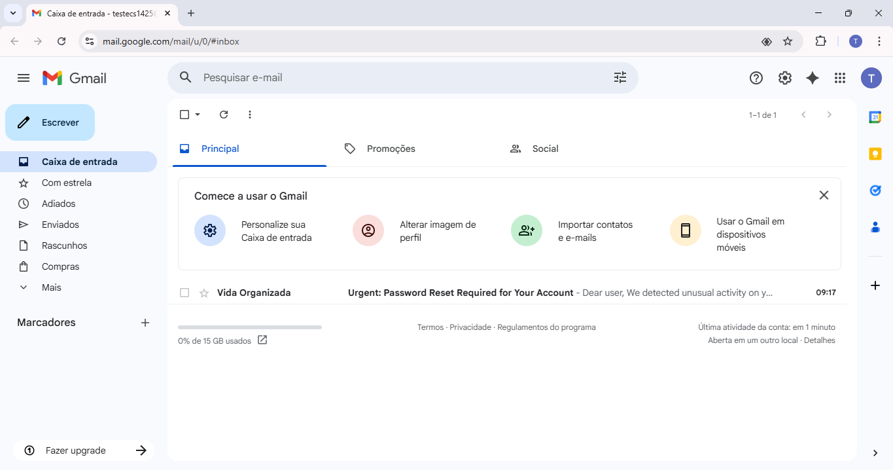
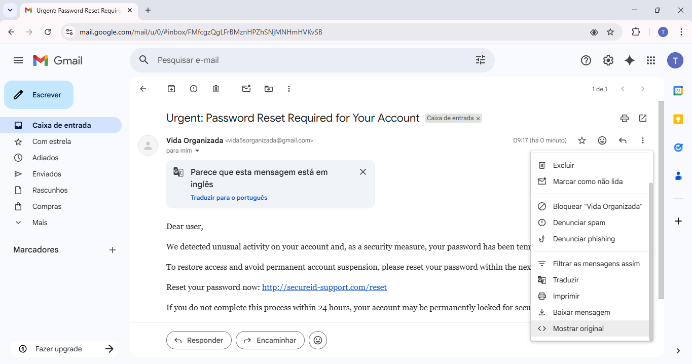
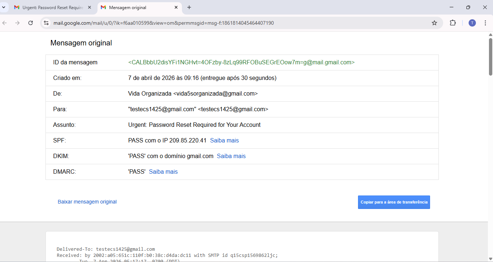
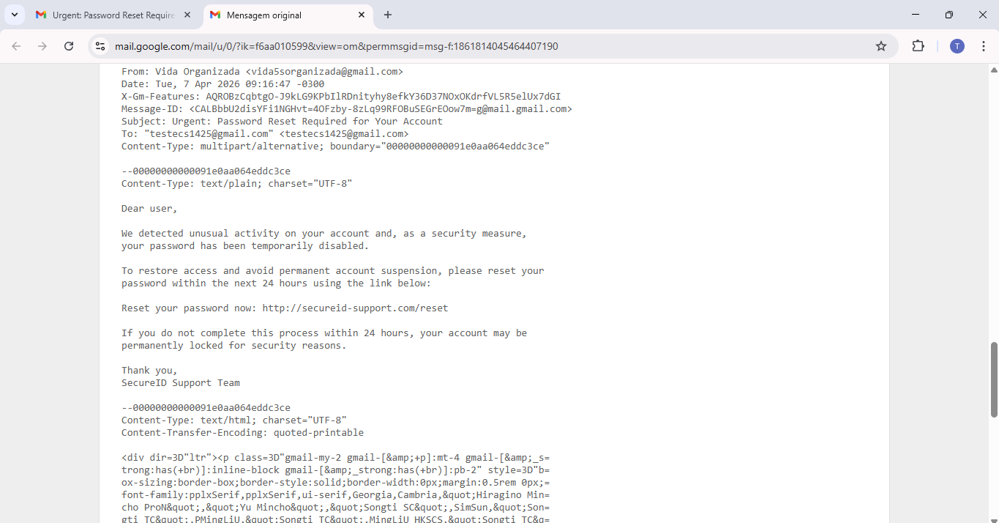
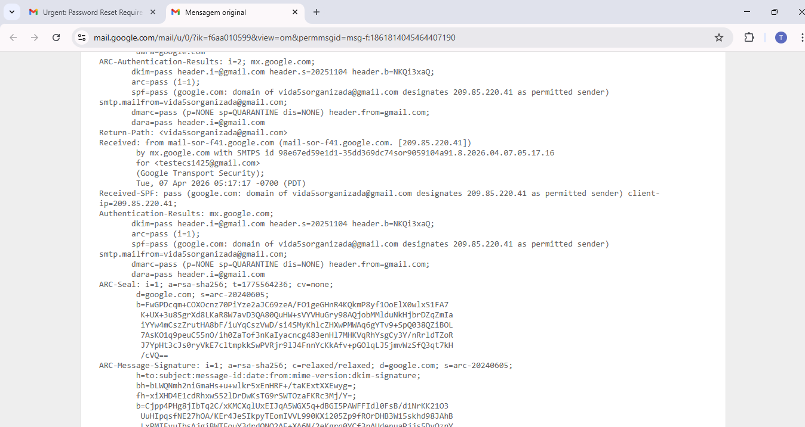

# 🔎 Análise de e-mail de phishing simulado (Lab SOC/Blue Team – Gmail) | Simulated Phishing Email Analysis (SOC/Blue Team Lab – Gmail)

---

## Practical SOC/Blue Team lab focused on phishing email analysis using Gmail test headers and incident-style documentation.

---

🇧🇷:

## 🧾 Objetivo do lab 

Simular o recebimento de um e-mail de redefinição de senha com características de phishing em uma conta de teste do Gmail e analisá-lo sob a perspectiva de um analista SOC/Blue Team.  
O foco é praticar a extração de cabeçalho, identificação de indicadores de phishing, avaliação de risco e documentação do incidente em formato de relatório.

## 🧪 Escopo e ambiente

- Provedor de e-mail: Gmail (conta de teste dedicada).  
- Caixa de entrada: `testecs1425@gmail.com`.  
- Origem: conta de e-mail controlada pelo analista, usada apenas para envio do e-mail simulado.  
- Contexto: cenário 100% controlado, sem envolvimento de usuários reais, clientes ou ambientes de produção.

## ✉️ Descrição do e-mail simulado

- Tipo de e-mail: mensagem de redefinição de senha com tom urgente.  
- Assunto (exemplo): `Urgent: Password Reset Required for Your Account`.  
- Corpo: texto informando suposta atividade suspeita, ameaça de bloqueio definitivo da conta em 24 horas e instrução para clicar em um link genérico de **“Reset your password now”**.  
- Link principal: `http://secureid-support.com/reset` (domínio fictício, usado apenas para fins educacionais – **não clicar**).

## 🧩 Indicadores observados

Principais pontos analisados no cabeçalho e conteúdo do e-mail:

- Nome exibido do remetente (**display name**) diferente de um serviço claramente reconhecível.  
- Endereço real de e-mail de origem não associado a um domínio corporativo ou provedor legítimo de **“SecureID”**.  
- Domínio do link de redefinição de senha diferente de domínios típicos de provedores de identidade ou do próprio Gmail.  
- Linguagem com forte senso de urgência (*“permanentemente bloqueada”, “24 hours”*) e ameaça de perda de acesso.  
- Ausência de informações personalizadas do usuário (**nome, dados específicos**), mensagem genérica.

## 🔍 Análise (perspectiva SOC)

Do ponto de vista de um analista SOC/Blue Team, esse e-mail apresenta vários elementos típicos de campanhas de phishing: urgência exagerada, ameaça de bloqueio, link externo genérico e falta de contexto personalizado.  
Em um ambiente real, o evento seria classificado como **“suspected phishing”** e sujeito a triagem mais detalhada e possíveis ações de bloqueio e conscientização do usuário.

## ✅ Ações recomendadas (se fosse produção)

Se este e-mail tivesse sido identificado em um ambiente produtivo, ações recomendadas incluiriam:

- Marcar e reportar o e-mail como phishing no cliente de e-mail, bloqueando o remetente e/ou domínio.  
- Notificar o usuário alvo para não clicar em links nem inserir credenciais, reforçando boas práticas de segurança.  
- Criar ou ajustar regras de segurança de e-mail para detectar padrões semelhantes de assunto, remetente e URL.  
- Caso algum usuário tenha clicado, aplicar redefinição de senha e revisar atividade recente da conta.

## 🔎 Enriquecimento com VirusTotal

- Em um ambiente de SOC real, após identificar um possível e-mail de phishing, o próximo passo natural seria enriquecer os indicadores coletados (principalmente domínio e URL) utilizando uma ferramenta como o **VirusTotal**.
- O fluxo típico seria: copiar o domínio ou a URL principal do e-mail e consultá-los no VirusTotal para verificar se já foram reportados como maliciosos ou suspeitos por diferentes mecanismos de detecção, além de observar histórico de detecção, categorias atribuídas (ex.: phishing, malware hosting) e possíveis relações com outros IoCs.  
- Esse tipo de enriquecimento ajudaria a fortalecer a classificação do incidente (por exemplo, confirmar que se trata de phishing conhecido) e a embasar recomendações de bloqueio de domínio/URL em proxies, firewalls ou ferramentas de e-mail security.

- Durante a análise, a URL `http://secureid-support.com/reset` foi consultada no VirusTotal. No momento da verificação, **61 mecanismos de detecção classificaram a URL como “clean” e 34 não possuíam avaliação (unrated)**, sem registros públicos de classificação como maliciosa ou de phishing.
- Mesmo assim, em contexto de SOC, o e-mail continuaria sendo tratado como suspeito, pois a ausência de detecção em feeds públicos não elimina o risco: o conteúdo ainda apresenta sinais típicos de phishing (linguagem urgente, ameaça de bloqueio de conta e link genérico de redefinição de senha para um domínio pouco conhecido). Nesse caso, o analista usa o VirusTotal como mais uma fonte de evidência, mas mantém a decisão apoiada principalmente na análise de contexto e de engenharia social.

## 🌐 Perspectiva de rede

- Embora neste lab o foco esteja na análise do e-mail em si, em um cenário real de phishing é importante entender o que aconteceria na rede caso o usuário clicasse no link malicioso.
- Ao clicar no link de redefinição de senha, o cliente do usuário (navegador) primeiro faria uma consulta **DNS** para resolver o domínio (por exemplo, `secureid-support.com`) em um endereço IP, normalmente usando a porta **53/UDP**. Em seguida, o navegador iniciaria uma conexão **HTTP ou HTTPS** com o servidor de destino, geralmente nas portas **80/TCP** (HTTP) ou **443/TCP** (HTTPS), enviando uma requisição que poderia ser registrada em logs de proxy, firewall ou servidor web. Esses registros de DNS e HTTP/HTTPS seriam valiosos para um analista SOC correlacionar cliques em links de phishing com possíveis páginas de captura de credenciais ou download de malware.

## 🧠 O que aprendi

- A extrair e interpretar o cabeçalho completo de um e-mail no Gmail, observando remetente real, domínio, subject e resultados de autenticação.  
- A identificar sinais típicos de phishing em e-mails de redefinição de senha, combinando análise técnica e de conteúdo.  
- A descrever o incidente em formato de relatório SOC, com resumo, escopo, indicadores, análise e recomendações.

---

🇺🇸:

## 🧾 Lab objective 

Simulate the receipt of a password reset phishing-style email in a Gmail test account and analyze it from a SOC/Blue Team perspective.  
The goal is to practice header extraction, phishing indicator identification, risk assessment and incident-style reporting.

## 🧪 Scope and environment

- Email provider: Gmail (dedicated test account).  
- Mailbox: `testecs1425@gmail.com`.  
- Source: email account controlled by the analyst, used only to send the simulated message.  
- Context: fully controlled lab scenario, with no real users, customers or production systems involved.

## ✉️ Simulated email description

- Email type: urgent password reset notification.  
- Subject (example): `Urgent: Password Reset Required for Your Account`.  
- Body: message claiming suspicious activity, warning about potential permanent account lock within 24 hours and asking the user to click a generic **“Reset your password now”** link.  
- Main link: `http://secureid-support.com/reset` (fictional domain, for training purposes only – **do not click**).

## 🧩 Indicators observed

Key points analyzed in the email header and body:

- Sender **display name** not clearly tied to a well-known legitimate service.  
- Actual sender email address not belonging to a corporate domain or a recognized identity provider for **“SecureID”**.  
- Password reset link domain different from typical identity provider or Gmail domains.  
- Strong sense of urgency in the wording (*“permanently locked”, “24 hours”*) and threat of account loss.  
- No personalized user information (**name or specific data**), generic messaging.

## 🔍 Analysis (SOC perspective)

From a SOC/Blue Team perspective, this email exhibits several common phishing traits: high urgency, account lock threats, a generic external link and lack of personalization.  
In a real environment, this would be classified as **suspected phishing** and subject to further triage, blocking actions and user awareness measures.

## ✅ Recommended actions (if this were production)

If this email had been detected in a production environment, recommended actions would include:

- Marking and reporting the email as phishing in the mail client, blocking the sender and/or domain.  
- Notifying the targeted user not to click any links or enter credentials, reinforcing security awareness.  
- Creating or tuning email security rules to detect similar combinations of subject, sender and URL patterns.  
- If any user had clicked the link, enforcing password reset and reviewing recent account activity.

## 🔎 Enrichment with VirusTotal (EN)

- In a real SOC environment, after identifying a potential phishing email, a natural next step would be to enrich the collected indicators (mainly domain and URL) using a tool like **VirusTotal**.  
- The typical workflow would be to copy the main domain or URL from the email and look it up in VirusTotal to check whether it has already been reported as malicious or suspicious by multiple detection engines, as well as to review detection history, assigned categories (e.g., phishing, malware hosting) and relationships with other IoCs.  
- This enrichment helps strengthen the incident classification (for example, confirming that it is a known phishing campaign) and supports recommendations to block the domain/URL at proxies, firewalls or email security gateways.

- During the analysis, the URL `http://secureid-support.com/reset` was checked in VirusTotal. At the time of the lookup, **61 detection engines classified the URL as “clean” and 34 had no rating (unrated)**, with no public records marking it as malicious or phishing.
- However, from a SOC perspective, the email would still be treated as suspicious, because the absence of detection in public feeds does not eliminate risk: the content still shows typical phishing patterns (urgent language, account lock threats and a generic password reset link pointing to an unknown domain). In this case, VirusTotal is used as one more evidence source, while the final decision relies mainly on context and social engineering analysis.

## 🌐 Networking perspective

- Although this lab focuses mainly on analyzing the email itself, in a real phishing scenario it is important to understand what would happen on the network if the user clicked the malicious link.
- When the user clicks the password reset link, the client (browser) would first perform a **DNS** lookup to resolve the domain (for example, `secureid-support.com`) to an IP address, typically using port **53/UDP**. Then, the browser would initiate an **HTTP or HTTPS** connection to the target server, usually over **80/TCP** (HTTP) or **443/TCP** (HTTPS), sending a request that could be recorded in proxy, firewall or web server logs. These DNS and HTTP/HTTPS records would be valuable for a SOC analyst to correlate phishing link clicks with potential credential harvesting pages or malware downloads.

## 🧠 What I learned

- How to extract and interpret full email headers in Gmail, focusing on real sender, domain, subject and authentication results.  
- How to identify common phishing signs in password reset emails, combining technical and content-based analysis.  
- How to describe the case using a SOC-style report structure with summary, scope, indicators, analysis and recommendations.

---

## ⚠️ Aviso importante / Important disclaimer

**🇧🇷:**  
Todas as atividades deste lab foram realizadas em ambiente controlado, utilizando apenas contas de e-mail de teste sob meu controle. Nenhum usuário real, cliente ou sistema de produção foi envolvido. O conteúdo do e-mail e os domínios utilizados são exclusivamente para fins educacionais.

**🇺🇸:**  
All activities in this lab were performed in a controlled environment using only test email accounts under my control. No real users, customers or production systems were involved. The email content and domains used are for educational purposes only.
